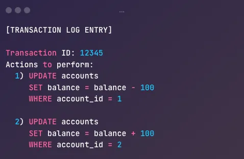
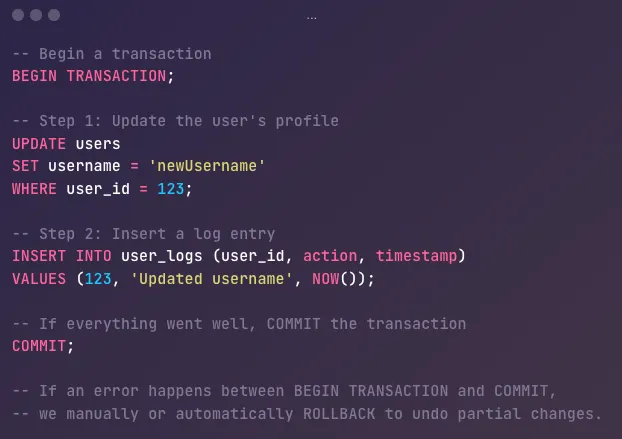

# What are ACID Transactions in Databases?

- Imagine you’re running an e-commerce application.
```
if a shop sells mobile phones, its inventory includes all the mobile phones available in the store or warehouse. When a customer buys one, the inventory decreases because one phone is sold.
```

```
Imagine you own a small shop that sells mobile phones.

A customer comes in and buys a phone.
You reduce the number of phones in your shop because one is sold (this is updating the inventory).
The customer pays using a credit card, so you charge their card (this is processing the payment).
You write down the sale in your records to keep track of earnings (this is updating the accounting system).
```
```
What happens if the payment fails but your inventory count has already been reduced? Or if your application crashes halfway through the process?
```

```
This is where ACID transactions come into play. They ensure that all the steps in such critical operations happen reliably and consistently.
```

# Atomicity, Consistency, Isolation, and Durability.

# What is a Database Transaction?

```
A transaction in the context of databases is a sequence of one or more operations (such as inserting, updating, or deleting records) that the database treats as one single action. It either fully succeeds or fully fails, with no in-between states.
```

```
Example: Bank Transfer

When you send money to a friend, two things happen:

Money is deducted from your account.

Money is added to their account.
These two steps form one transaction. If either step fails, both are canceled.

Without transactions, databases could end up in inconsistent states.

```
```
Atomicity is one of the key properties of database transactions (ACID properties). It ensures that a transaction is treated as a single unit—either all operations in the transaction are completed successfully, or none are executed at all. This prevents partial updates that could lead to data inconsistency.
```

```
Example:
Let’s say a customer orders a phone online:

The system reduces the inventory (removes one phone).
It charges the customer's credit card for payment.
It records the sale in the accounting system.
If step 2 (charging the card) fails, atomicity ensures that step 1 (reducing inventory) and step 3 (recording the sale) are also canceled. This prevents a situation where the phone is removed from stock but the payment didn’t go through.

This way, the system remains consistent and error-free.
```
# How Databases Implement Atomicity
- Databases use two key mechanisms to guarantee atomicity.
# 1. Transaction Logs (Write-Ahead Logs)
```
Every operation is recorded in a write-ahead log before it’s applied to the actual database table.

If a failure occurs, the database uses this log to undo incomplete changes.
```



# 2. Commit/Rollback Protocols
```
Databases provide commands like BEGIN TRANSACTION, COMMIT, and ROLLBACK

Any changes made between BEGIN TRANSACTION and COMMIT are considered “in-progress” and won’t be permanently applied unless the transaction commits successfully.

If any step fails, or if you explicitly issue a ROLLBACK, all changes since the start of the transaction are undone.
```


