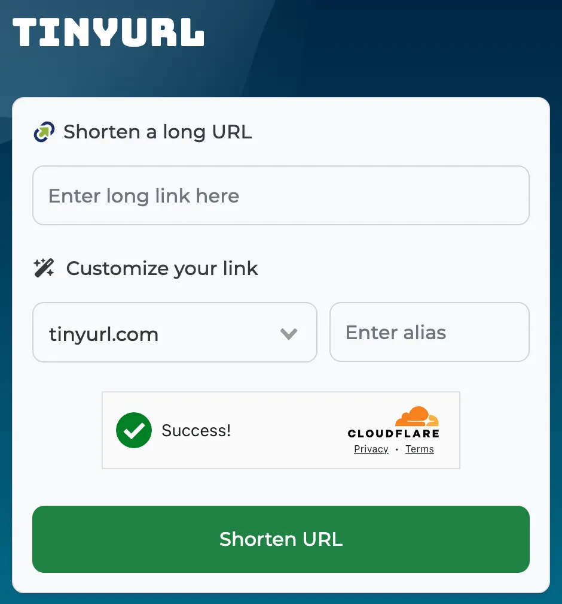

# Design a URL Shortener

```
A URL shortener is a service that takes a long URL and returns a shorter, unique alias that redirects to the original URL.
```



# 1. Requirements Gathering
```
Before diving into the design, lets outline the functional and non-functional requirements.
```
1.1 Functional Requirements:

Generate a unique short URL for a given long URL

Redirect the user to the original URL when the short URL is accessed

Allow users to customize their short URLs (optional)

Support link expiration where URLs are no longer accessible after a certain period

Provide analytics on link usage (optional)