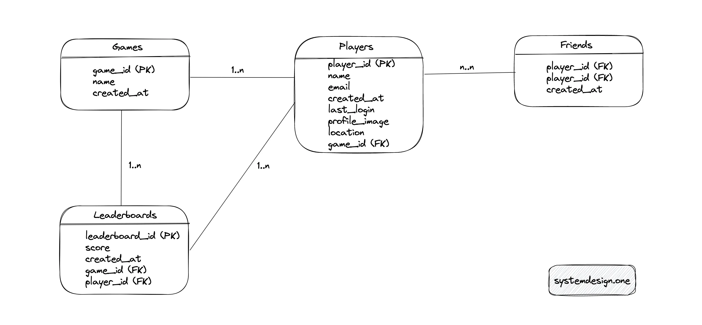
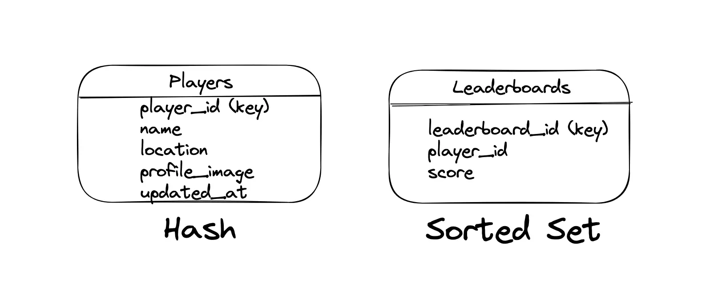
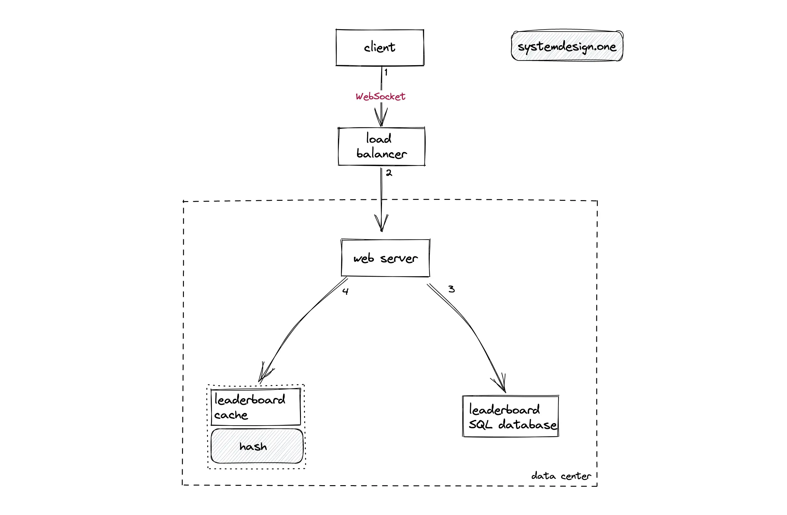

```
A leaderboard is a ranking system used in games, competitions, or websites to show the top performers based on their scores.
```

# How does a Leaderboard Work with Redis Sorted Set?
```

🔹 Think of it like a high-score table in a video game.

Example: Online Game Leaderboard (PUBG, Free Fire, or Ludo King)
Imagine you and your friends are playing an online game. The game needs to track everyone's scores in real-time. 

When you score points, Redis stores your name along with your score.


("Alice", 5000 points)
("Bob", 7000 points)
("Charlie", 6000 points)
Redis automatically sorts players based on their scores.

Bob (7000 points) is ranked #1
Charlie (6000 points) is ranked #2
Alice (5000 points) is ranked #3
If Alice scores 3000 more points (total: 8000), Redis will immediately update the rankings.

Now, Alice moves to Rank #1 because 8000 > 7000.
✔ Redis does this sorting super fast (logarithmic time), even if there are millions of players!

```

# Questions to ask the Interviewer

- Candidate
```
What are the primary use cases of the system?
Are the clients distributed across the globe?
What is the amount of Daily Active Users (DAU) for writes?
What is the anticipated read: write ratio?
Should the leaderboard be available in real-time?

```
# Interviewer

```
Update the score and display the leaderboard
Yes
50 million DAU
5: 1
Yes

```
# Requirements 
## Functional Requirements
- The client (player) can view the top 10 players on the leaderboard in real-time (absolute leaderboard)
- The client can view a specific player’s rank and score
- The client can view the surrounding ranked players to a particular player (relative leaderboard)
- The client can receive score updates through push notifications
- The leaderboard can be configured for global, regional, and friend circles
- The client can view the historical game scores and historical leaderboards
- The leaderboards can rank players based on gameplay on a daily, weekly, or monthly basis
- The clients can update the leaderboard in a fully distributed manner across the globe
- The leaderboard should support thousands of concurrent players

# Non-Functional Requirements

- High availability
- Low latency
- Scalability
- Reliability
- Minimal operational overhead

# Leaderboard API
```
- The components in the system expose the Application Programming Interface (API) endpoints through - - Representational State Transfer (REST) or Remote Procedure Call (RPC). The best practice to expose - public APIs is through REST because of the loose coupling and the easiness to debug. Once the services - harden and performance should be tuned further, switch to RPC for internal communications between services. The tradeoffs of RPC are tight coupling and difficulty in debugging 5, 6.

```

```
The description of HTTP Request headers is the following
Header	                     Description
authorization	     authorize your user account
content-encoding	 compression type used by the data payload
method	HTTP         Verb
content-type	     type of data format (JSON or XML)
user-agent	         use to identify the client for analytics

The description of HTTP Response headers is the following:

Header	                    Description
status code	        shows if the request was successful
cache-control	    set cache
content-encoding	compression type used by the payload
content-type	    type of data format
```


## How to update the score of a player?

```

/players/:player-id/scores
method: POST
authorization: Bearer <JWT>
content-length: 100
content-type: application/JSON
content-encoding: gzip
{
    player_id: <int>,
    score: <int>,
    location: Geohash
}

The server responds with status code 200 OK on success.

```

# How to view a specific player’s rank and score?
The client executes an HTTP GET request to view a specific player’s rank and score. There is no request body for an HTTP GET request.
```
status code: 200 OK
cache-control: private, no-cache, must-revalidate, max-age=5
content-encoding: gzip
content-type: application/json

{
    player_id: "45231",
    player_name: "Rick",
    score: 1562,
    rank: 1,
    updated_at: "2030-10-10T12:11:42Z"
}

```

# top 10 players in leaderboard
```
status code: 200 OK
cache-control: public, no-cache, must-revalidate, max-age=5
content-encoding: gzip
content-type: application/json

{
  total: 10, (count)
  updated_at: "2030-10-10T12:11:42Z",
  data: [
    {
      player_id: "45231",
      player_name: "Rick",
      score: 1562,
      rank: 1,
    },
    {...}
  ]
}
```

## Leaderboard data storage

- The read: write ratio is 5: 1, so the leaderboard is a relatively write-heavy system. In other words, - the dominant usage pattern is the client updating the score.

# Leaderboard database schema design



```
The major entities of the relational database are the Players table, the Games table, the Leaderboards table, and the Friends table. The relationship between the Games and the Players' tables is 1-to-many. The Friends table is an associative entity that defines the follower-followee relationship between players. The relationship between the Games and the Leaderboards tables is 1-to-many to support global, regional, and friend circles leaderboards. The relationship between the Players and Leaderboards tables is 1-to-many.

```


## Games table
``` 
Column	                 Description
game_id	             ID to identify the game
name	             name of the game
created_at	         creation timestamp
```

## Sample data of Games table
```
game_id	        name	        created_at
1	          apex legends	     2019-25-03
2	           minecraft	     2011-16-02
```

## Players table
```
Column	                                  Description

player_id	                          ID to identify the player
name	                              name of the player
email	                              email of the player
created_at	                          timestamp of player account creation
last_login	                          timestamp of last login by player
profile_image	                      object store URL where images are stored
location	                          region of the player
game_id (Foreign key)	              game played by the player

```
```
player_id	name	email	         created_at	last_login	profile_image	location	 game_id
41	        morty	morty@xyz.com	2019-04-01	2019-04-01	s3://url-image	canada	      1
42	        rick	rick@xyz.com	2019-04-01	2019-04-01	s3://url-image	canada	       1
```

# Write a SQL query to insert a new player

```
INSERT INTO leaderboards (leaderboard_id, score, created_at, game_id, player_id)
VALUES ("apex_legends", 1, "2050-08-22", "1", "42");
```

# Write a SQL query to update the score of a player
```
UPDATE leaderboards
SET score = score + 1
WHERE player_id = '42';
```
# Write a SQL query to fetch the total score of a player for the current month
```
SELECT sum(score)
FROM leaderboards
WHERE player_id = '42' and created_at >= "2025-03-10";

```
# Write a SQL query to calculate the scores and rank the top 10 players

```
SELECT player_id, SUM(score) AS total
FROM leaderboards
GROUP BY player_id
ORDER BY total DESC
LIMIT 10;

```
# Capacity Planning
```
The calculated numbers are approximations. The player-id can be a 30-character string consuming approximately 30 bytes. The score of a player can be a 16-bit integer consuming 2 bytes of storage.
```

# Traffic
```
Description   	     Value

DAU (write)	        50 million
QPS (write)	        600
read: write	        5: 1
QPS (read)   	      3000
peak QPS (read)	    3600

DAU (write) – Daily Active Users (write)

This represents the number of users performing write operations daily (50 million in your case).

QPS (write) – Queries Per Second (write)

This refers to the number of write queries the system handles per second (600 in your case).

Read: Write – Read to Write Ratio

This indicates the proportion of read operations to write operations (5:1 in your case, meaning there are five read operations for every one write operation).
QPS (read) – Queries Per Second (read)

This refers to the number of read queries the system handles per second (3000 in your case).
Peak QPS (read) – Peak Queries Per Second (read)

This represents the highest number of read queries handled per second during peak load times.

```

# Memory
```
Description	                       Calculation    	                    Total

total player count		                                                70 million
single record of a player	         (30 + 2) bytes	                    32 bytes
total storage for all players	     70 million * 32 bytes	             2.2 GB
```
# High Level Design 




