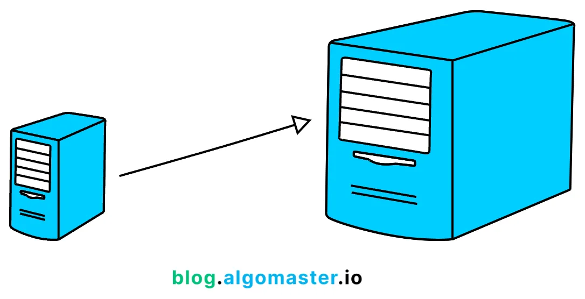
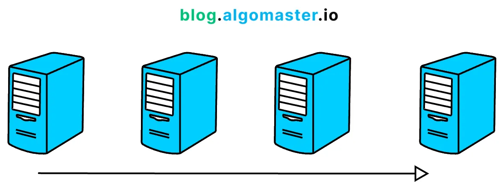
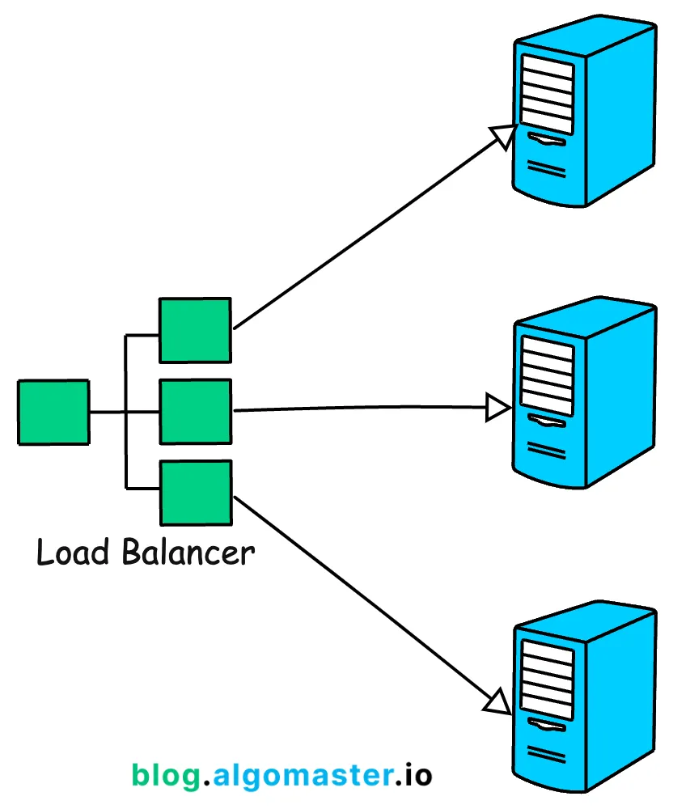
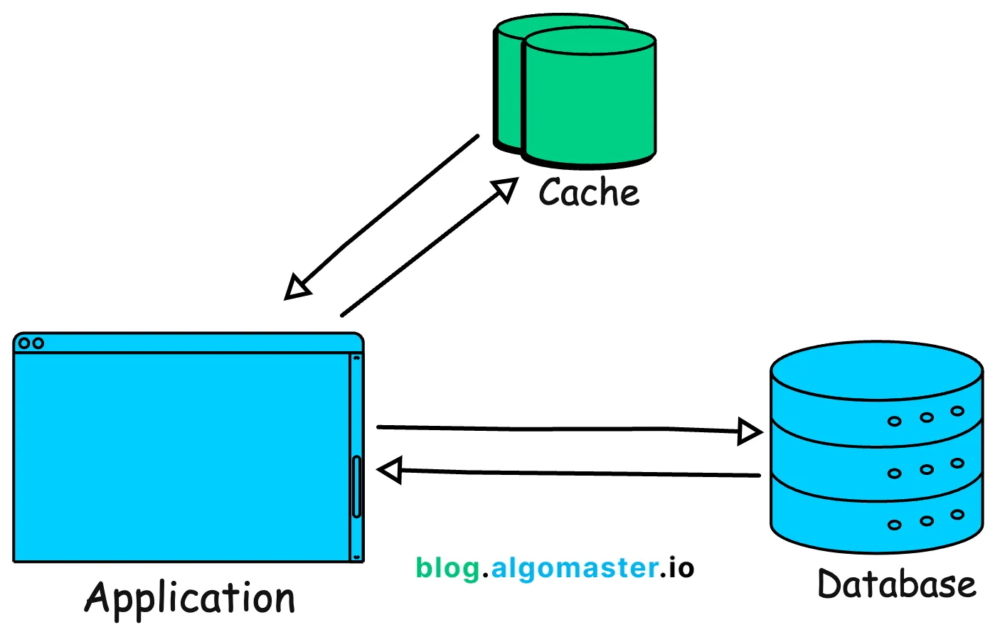
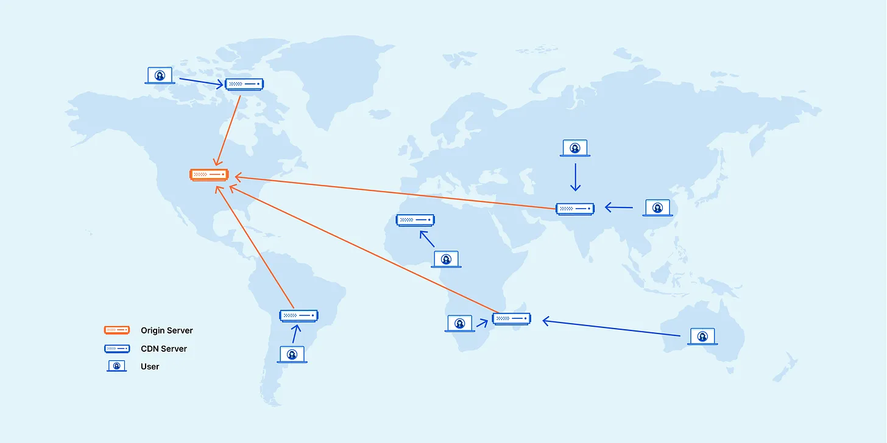
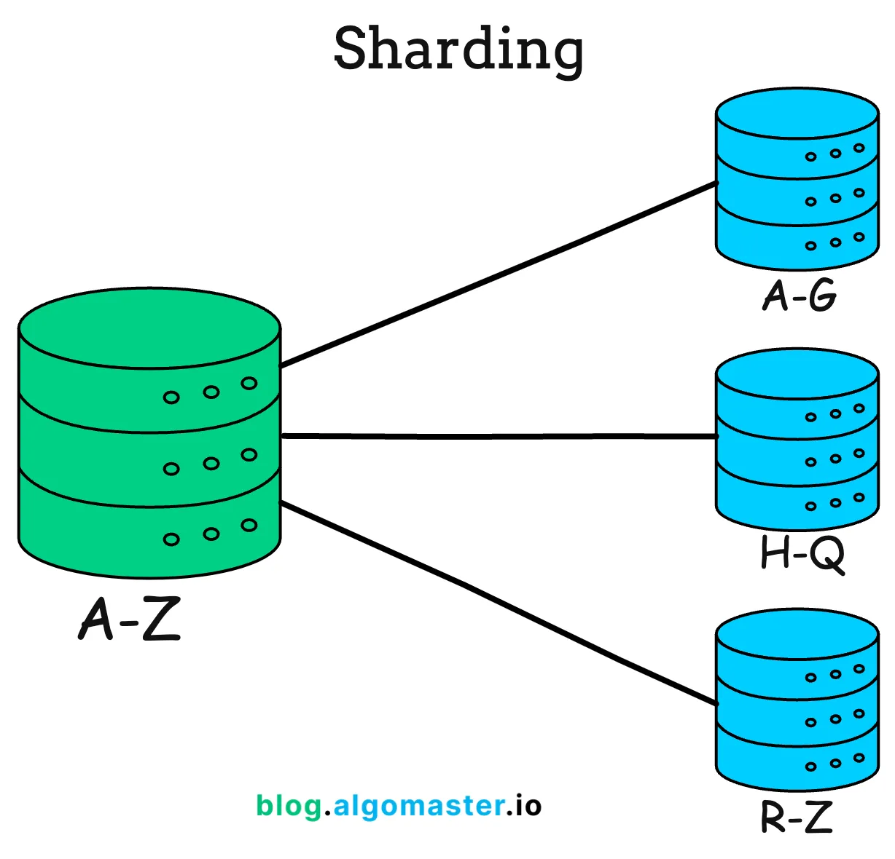
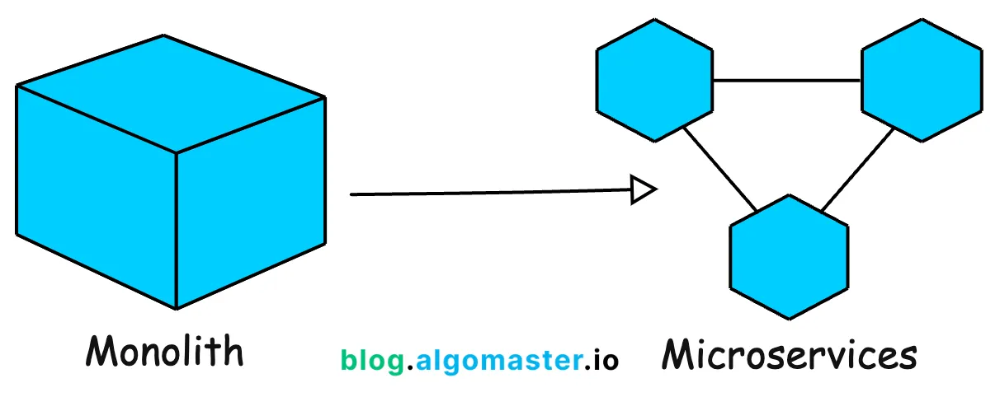

```
Scalability is the property of a system to handle a growing amount of load by adding resources to the system
```

# How can a System Grow?

- A system can grow in several dimensions
 


## 1 . Growth in User Base
```
More users started using the system, leading to increased number of requests.

Example: A social media platform experiencing a surge in new users
```
## 2.  Growth in Features
```
More features were introduced to expand the system's capabilities.

Example: An e-commerce website adding support for a new payment method
```

## 3. Growth in Data Volume
```
Growth in the amount of data the system stores and manages due to user activity or logging.

Example: A video streaming platform like youtube storing more video content over time.
```
## 4. Growth in Complexity
```
The system's architecture evolves to accommodate new features, scale, or integrations, resulting in additional components and dependencies.

Example: A system that started as a simple application is broken into smaller, independent systems.
```


## 5. Growth in Geographic Reach
```
The system is expanded to serve users in new regions or countries.

Example: An e-commerce company launching websites and distribution in new international markets.
```

# How to Scale a System?

- Here are 10 common ways to make a system scalable:

## 1. Vertical Scaling (Scale up)
```
This means adding more power to your existing machines by upgrading server with more RAM, faster CPUs, or additional storage.

It's a good approach for simpler architectures but has limitations in how far you can go.
```




## 2. Horizontal Scaling (Scale out)

```
This means adding more machines to your system to spread the workload across multiple servers.

It's often considered the most effective way to scale for large systems.
```



```
Example: Netflix uses horizontal scaling for its streaming service, adding more servers to their clusters to handle the growing number of users and data traffic
```

## 3. Load Balancing
```
Load balancing is the process of distributing traffic across multiple servers to ensure no single server  receiving too much traffic or load.
```


```
Think of Google as a very busy restaurant with millions of customers (users) coming in every second to order food (search queries).

Now, imagine if all customers had to go to just one cashier (server) to place their orders. That cashier would get overwhelmed, leading to long wait times or even breaking down (server crash).

To fix this, the restaurant (Google) has many cashiers (servers) and a manager (load balancer) who directs each customer to an available cashier. This way:

No single cashier gets too many orders.
Customers are served quickly.
The restaurant runs smoothly

```

## 4. Caching
```
Caching is a technique to store frequently accessed data in-memory (like RAM) to reduce the load on the server or database.

Implementing caching can dramatically improve response times

```



```

Example: Reddit uses caching to store frequently accessed content like hot posts and comments so that they can be served quickly without querying the database each time.
```

# 5. Content Delivery Networks (CDNs)
```
CDN distributes static assets (images, videos, etc.) closer to users. This can reduce latency and result in faster load times.
```

```

Example: Cloudflare provides CDN services, speeding up website access for users worldwide by caching content in servers located close to users.
```


# 6. Sharding/Partitioning
```
Partitioning means splitting data or functionality across multiple nodes/servers to distribute workload and avoid bottlenecks.
A bottleneck is a point in a system where the flow of data slows down due to limited capacity, causing delays and reducing efficiency.

Example in Simple Terms:
Imagine a busy highway where thousands of cars (data) are moving smoothly. Suddenly, the road narrows to a single lane due to construction. This creates a traffic jam (bottleneck), slowing down all cars.

In computing, a bottleneck happens when a single server or component can't handle too much data at once, causing delays. Partitioning helps by splitting the workload across multiple servers, just like opening more lanes on a highway to keep traffic flowing smoothly.
```



# 7. Asynchronous communication
```
Asynchronous communication means deferring long-running or non-critical tasks to background queues or message brokers.
```
```
It means not waiting for a task to finish before moving on to the next one. Instead, the task is sent to the background, and other work continues without delay
```

# 8. Microservices Architecture
```
Micro-services architecture breaks down application into smaller, independent services that can be scaled independently.

This improves resilience and allows teams to work on specific components in parallel

```

``` 
Example : Uber has evolved its architecture into microservices to handle different functions like billing, notifications, and ride matching independently, allowing for efficient scaling and rapid development.
```


# 9.  Auto-Scaling
```
Auto-Scaling means automatically adjusting the number of active servers based on the current load.

This ensures that the system can handle spikes in traffic without manual intervention
```


# 10. Multi-region Deployment
Deploy the application in multiple data centers or cloud regions to reduce latency and improve redundancy

